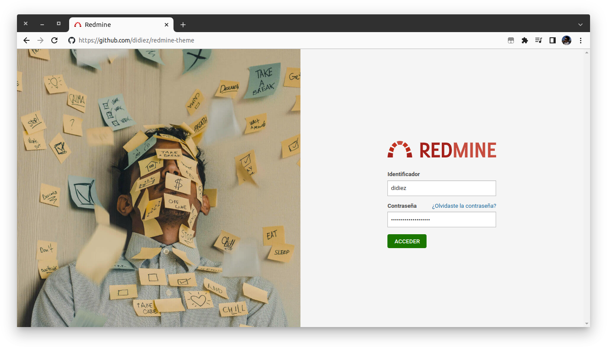
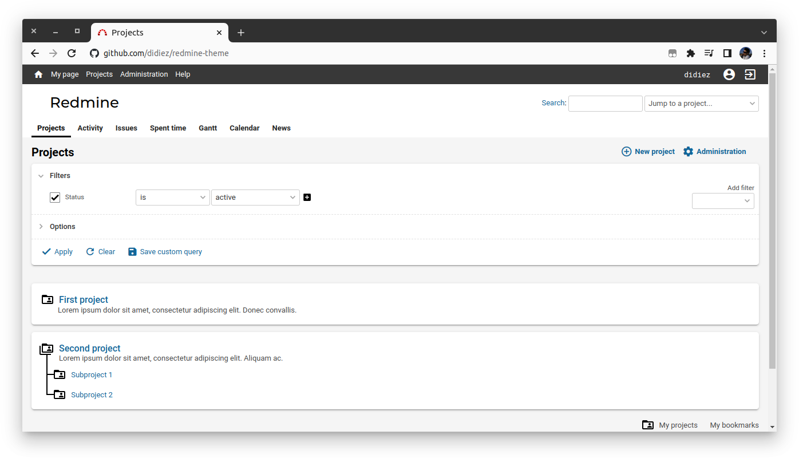

# Didiez redmine theme

## Working demo

1. Run redmine in a docker container
```
docker-compose up -d
```
2. Go to <http://localhost:8080/> (admin/admin)
3. Change the default theme to `didiez` in <http://localhost:8080/settings?tab=display>

## Screenshots

### Login


### Projects
